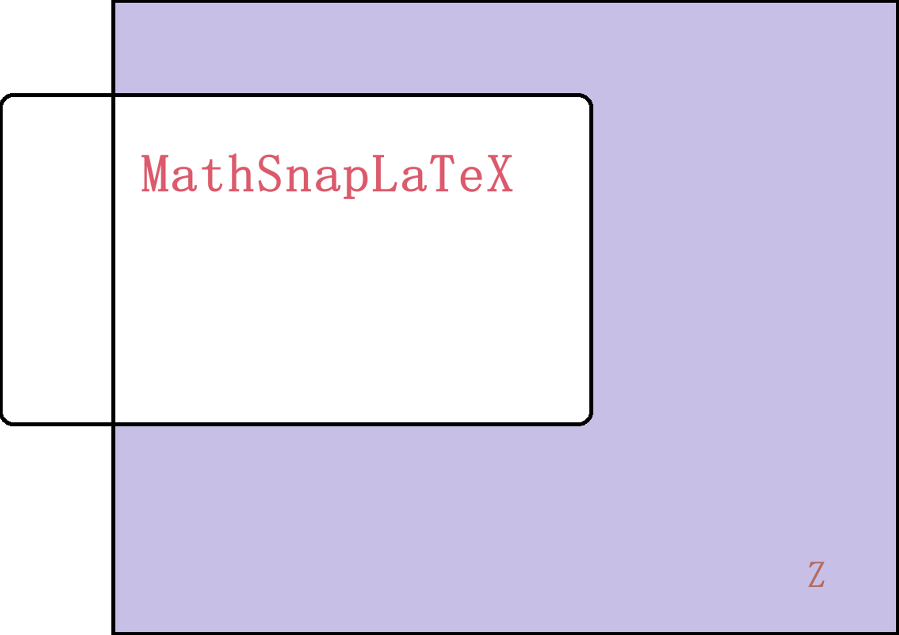
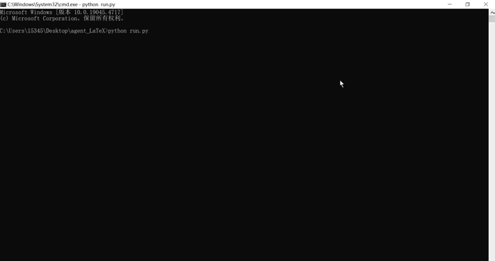

# MathSnapLaTeX
---


通过对数学公式进行截图，生成LaTeX数学公式

By taking screenshots of mathematical formulas, generate LaTeX math formulas


# 安装 Installation
---


## Code
---
安装依赖:

   ```bash
   pip install -r requirements.txt 
   ```

如果下载慢，中国大陆用户可以使用清华源进行依赖的下载:

  ```bash
  pip install -r requirements.txt -i https://pypi.tuna.tsinghua.edu.cn/simple/
  ```

运行run.py:

   ```bash
   python run.py
   ```


## 应用 application
---
  <p align="center">
        <a href="https://gitee.com/FYOUZI/MathSnapLaTeX/releases"></a>
        <a href='https://github.com/J-LingShan/MathSnapLaTeX/releases'></a>
  </p>


# API-KEY
---
[](https://bailian.console.aliyun.com/?apiKey=1#/api-key-center)


# 清单 TODO
---
- [ ] 修复request_agent2  Fix request_agent2

- [ ] 优化响应处理  Optimize response handling


# History
---
  
  <p align="center">

    <br>
    <br>
        <a href=""></a>
        <a href=''></a>
        <a href=''></a>
        <a href=''></a>
    <br>
    
  </p>


[
